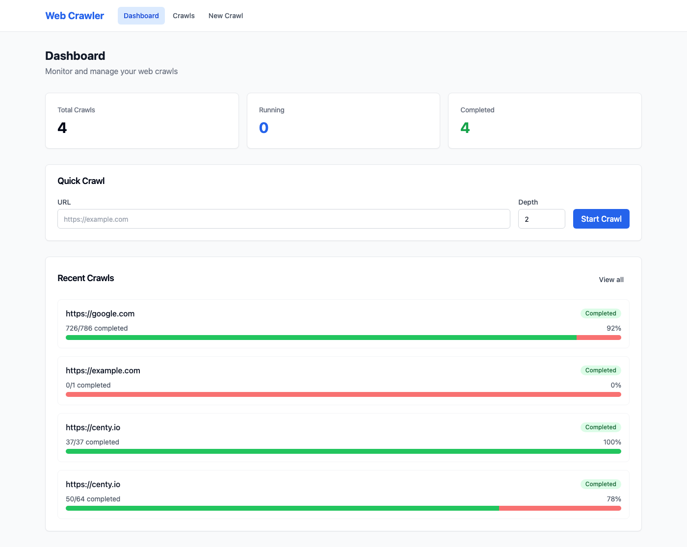
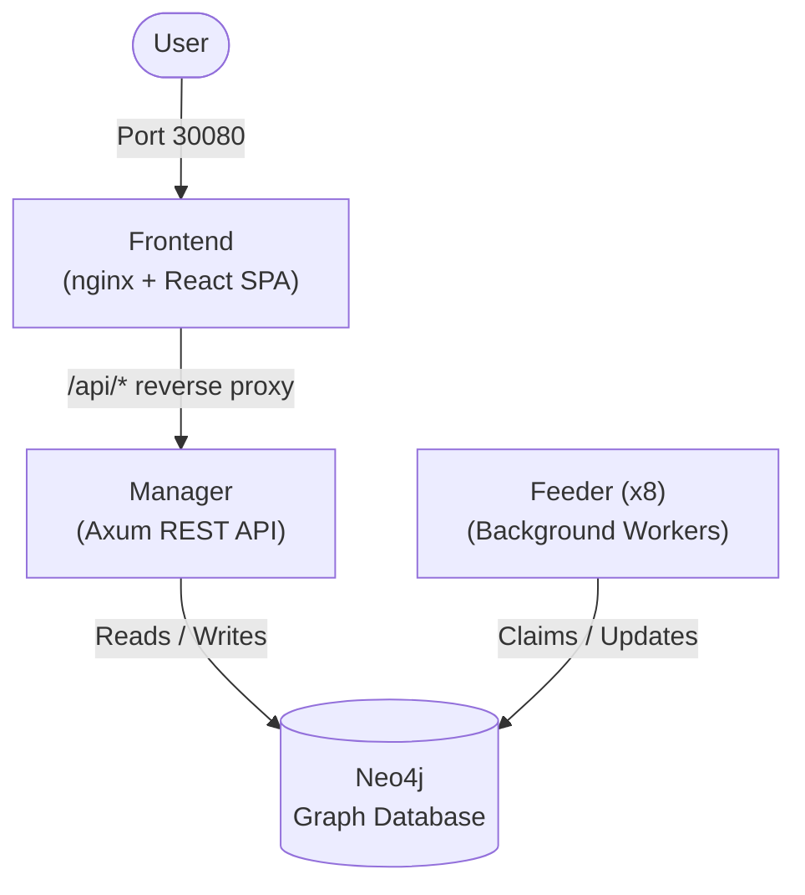
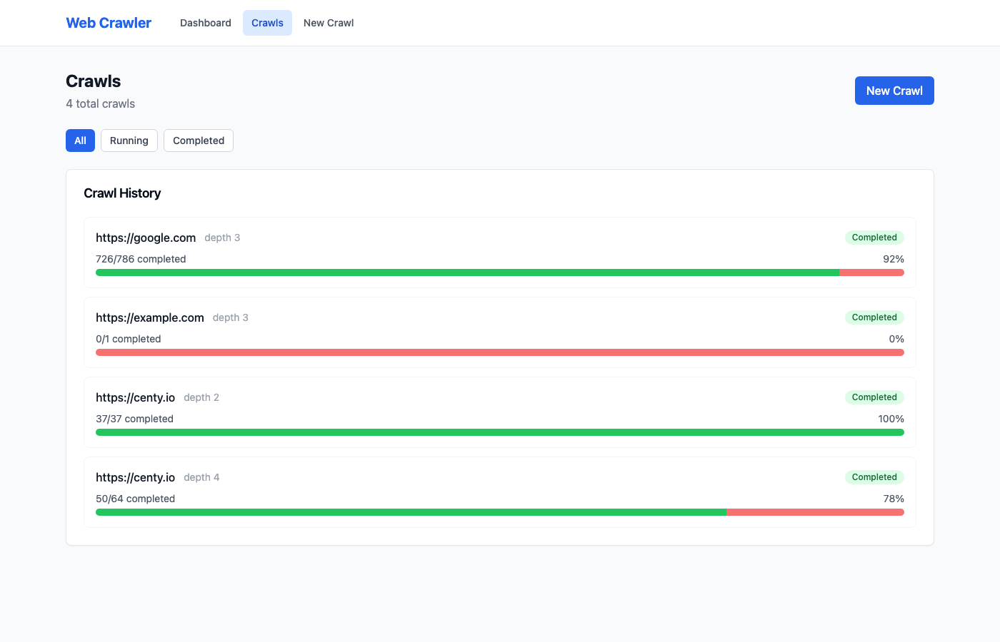
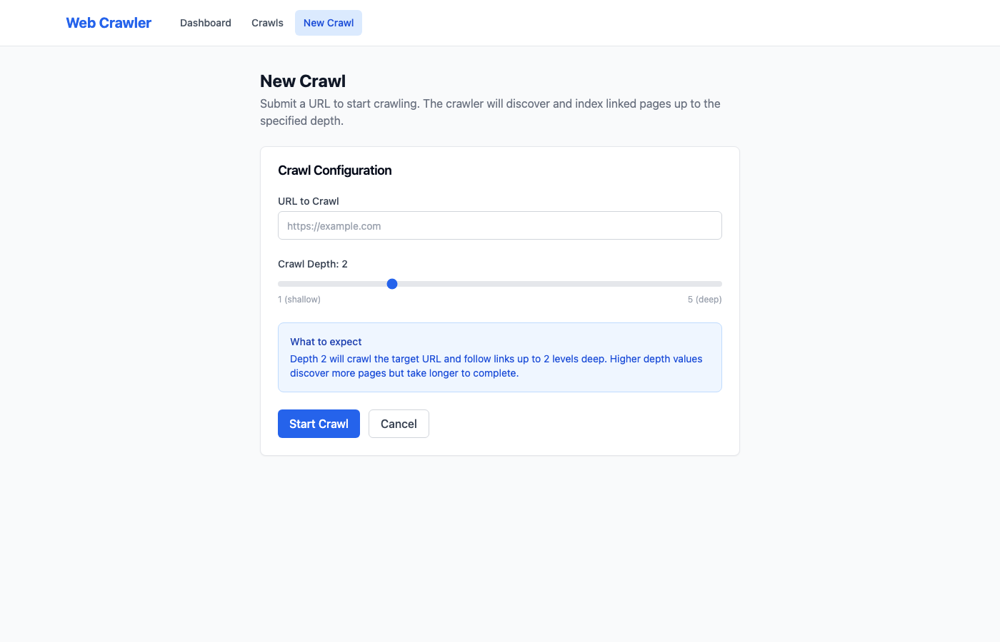
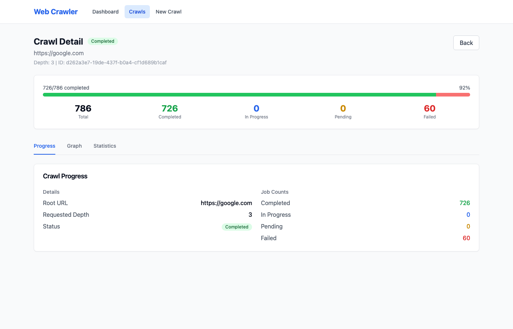
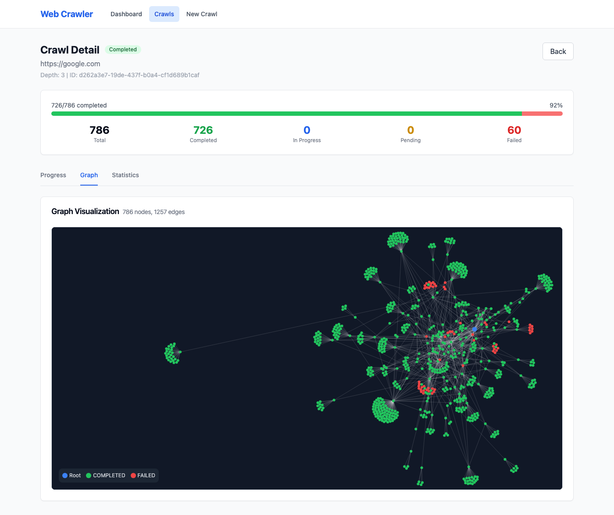
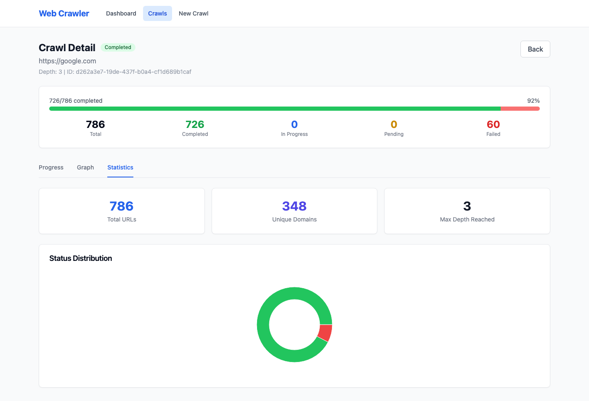

[](https://github.com/bluedotiya/web-crawler/actions/workflows/docker-publish-master.yml)[](https://github.com/bluedotiya/web-crawler/actions/workflows/pr-title.yml)

# Web Crawler

A distributed, recursive web crawler built in Rust. Feed it a URL and it maps all linked websites at a chosen depth, storing the graph in Neo4j and visualizing it in a React frontend.



## Features

- **Recursive crawling** — follow links up to a configurable depth
- **Distributed workers** — 8 feeder replicas process URLs in parallel
- **Graph storage** — Neo4j stores URL nodes and link relationships
- **Real-time progress** — WebSocket updates stream crawl status live
- **Interactive graph visualization** — force-directed graph with color-coded node status
- **Crawl management** — create, monitor, cancel, and review crawl statistics
- **Kubernetes-native** — Helm chart deploys all services with a single command

## Architecture



| Service | Tech | Role |
|---------|------|------|
| **Frontend** | nginx + React/Vite/TypeScript | SPA UI, API reverse proxy |
| **Manager** | Rust + Axum | REST API, crawl initiation, WebSocket |
| **Feeder** | Rust | Background URL processing workers |
| **Neo4j** | Neo4j 5.x | Graph database for crawl data |

## Quick Start

### Prerequisites

- [kubectl](https://kubernetes.io/docs/tasks/tools/) + [Helm 3.x](https://helm.sh/docs/intro/install/)
- A Kubernetes cluster (minikube, EKS, GKE, etc.)

### Install

```bash
helm install web-crawler oci://ghcr.io/bluedotiya/web-crawler/charts/web-crawler \
  --version 1.0.0 -n web-crawler --create-namespace
```

### Verify

```bash
kubectl rollout status statefulset/crawler-neo4j -n web-crawler
kubectl get pods -n web-crawler
```

### Access the UI

```bash
# Get your node IP
minikube ip   # or use your cluster's external IP

# Open the frontend
open http://<NODE_IP>:30080
```

### Start a crawl

Use the web UI at `/new`, or via the API:

```bash
curl -X POST http://<NODE_IP>:30080/api/v1/crawls \
  -H 'Content-Type: application/json' \
  -d '{"url": "https://example.com", "depth": 2}'
```

## Screenshots

<table>
  <tr>
    <td><strong>Dashboard</strong><br/></td>
    <td><strong>Crawl List</strong><br/></td>
  </tr>
  <tr>
    <td><strong>New Crawl</strong><br/></td>
    <td><strong>Crawl Progress</strong><br/></td>
  </tr>
  <tr>
    <td><strong>Graph Visualization</strong><br/></td>
    <td><strong>Statistics</strong><br/></td>
  </tr>
</table>

## Documentation

| Document | Description |
|----------|-------------|
| [Architecture](docs/architecture.md) | System design, data flow, concurrency model, WebSocket protocol |
| [Neo4j Graph Model](docs/neo4j-graph-model.md) | Node labels, properties, relationships, indexes, example queries |
| [API Reference](docs/api-reference.md) | REST endpoints, request/response schemas, WebSocket protocol |
| [Deployment Guide](docs/deployment.md) | Helm install, configuration reference, scaling, monitoring |
| [Development Guide](docs/development.md) | Local setup, testing, CI/CD pipeline, conventional commits |

## Tech Stack

| Layer | Technology |
|-------|-----------|
| Backend | Rust, Axum, Tokio, neo4rs, hickory-resolver |
| Frontend | React, TypeScript, Vite, Tailwind CSS |
| Database | Neo4j 5.x |
| Infra | Docker, Kubernetes, Helm, GitHub Actions |
| Registry | GitHub Container Registry (GHCR) |

## Contributing

1. Fork the repository
2. Create a feature branch from `master`
3. Follow [conventional commit](https://www.conventionalcommits.org/) format for PR titles
4. Ensure all checks pass: `cargo test --workspace && cargo clippy --workspace -- -D warnings`
5. For frontend changes: `cd frontend && npm run lint && npm run type-check`
6. Open a pull request — PRs are squash-merged, and the title drives the version bump

See the [Development Guide](docs/development.md) for detailed setup instructions.

## Security

- Report security vulnerabilities via [GitHub Security Advisories](https://github.com/bluedotiya/web-crawler/security/advisories)
- The crawler does not fetch or parse `robots.txt` — it extracts URLs via regex from raw HTML
- All services run as non-root users in containers
- Neo4j credentials are stored in Kubernetes secrets

## License

This project is licensed under the [GPL-3.0 License](LICENSE).
