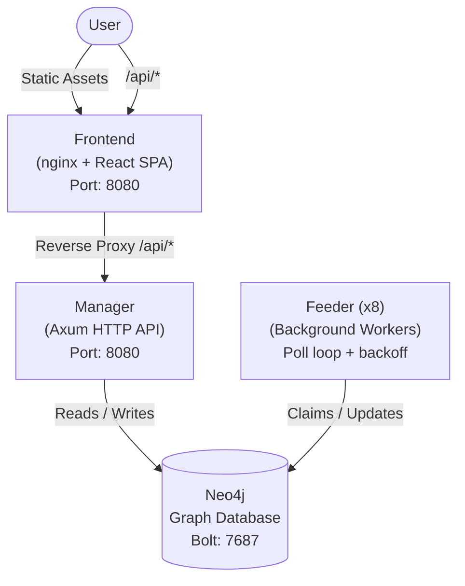
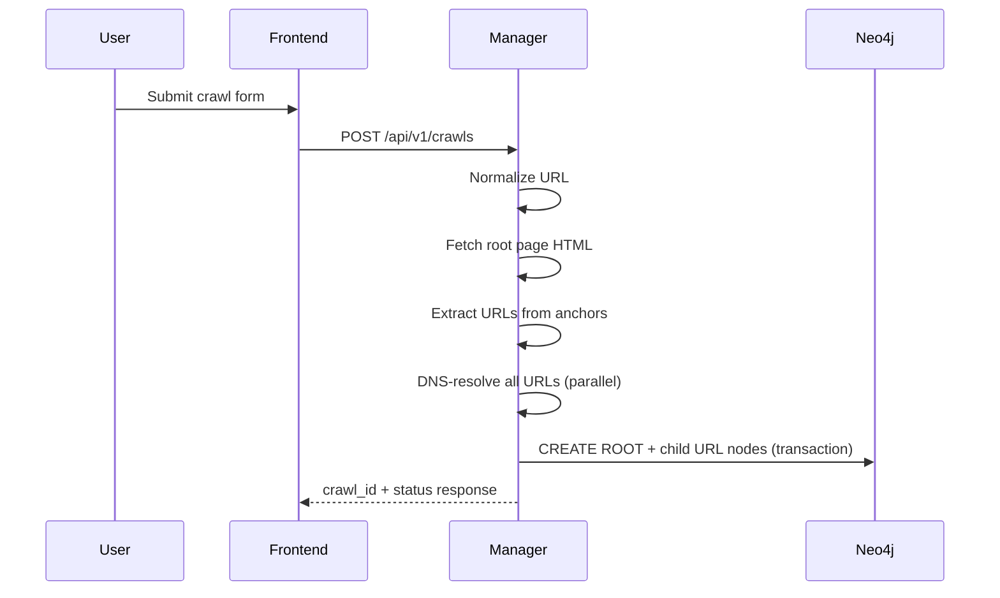
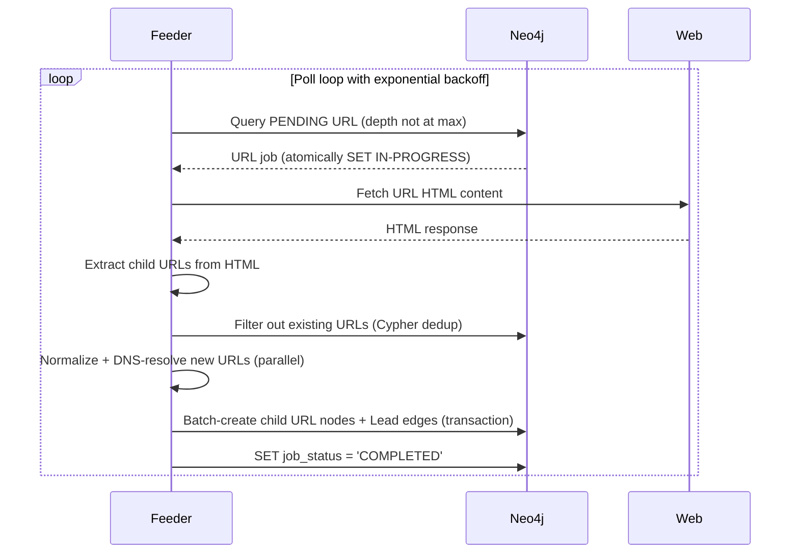
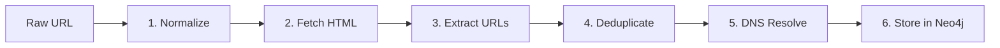

# Architecture

This document describes the system architecture of the Web Crawler project.

## System Overview



## Service Responsibilities

### Frontend

- **Technology**: nginx serving a React SPA (Vite + TypeScript + Tailwind CSS)
- **Port**: 8080
- **Role**: User-facing interface for managing and monitoring crawls
- **Routing**: nginx serves `index.html` for all unmatched paths (SPA fallback), reverse-proxies `/api/*` requests to the Manager service, and proxies WebSocket upgrades for real-time progress
- **Static asset caching**: JS, CSS, images, and fonts are served with a 1-year `Cache-Control: public, immutable` header

### Manager

- **Technology**: Rust + Axum HTTP framework
- **Port**: 8080 (mapped to service port 80 via ClusterIP)
- **Role**: API server that accepts crawl requests, queries crawl status, and serves graph data
- **Key responsibilities**:
  - Accept and validate new crawl requests
  - Fetch the root URL's HTML and extract child URLs
  - DNS-resolve all extracted URLs in parallel
  - Create the ROOT node and initial child URL nodes in Neo4j
  - Serve REST endpoints for listing, querying, and cancelling crawls
  - Provide WebSocket connections for real-time crawl progress
  - Health/readiness probes for Kubernetes

### Feeder

- **Technology**: Rust background worker (no HTTP server, except a health endpoint on port 8081)
- **Replicas**: 8 (configurable via `feeder.replicaCount`)
- **Role**: Process pending URL jobs from Neo4j
- **Key responsibilities**:
  - Poll Neo4j for PENDING URL nodes
  - Atomically claim jobs using `SET n.job_status = 'IN-PROGRESS'`
  - Fetch HTML, extract URLs, resolve DNS, create child nodes
  - Reclaim stale jobs stuck in IN-PROGRESS beyond a configurable timeout
  - Gracefully reset claimed jobs to PENDING on shutdown

### Neo4j

- **Version**: 5.x (deployed via the official Neo4j Helm chart)
- **Ports**: HTTP browser (7474, NodePort 30074), Bolt protocol (7687, NodePort 30087)
- **Role**: Graph database storing crawl data — URL nodes and Lead relationships

## Data Flow

### 1. User Submits a Crawl



### 2. Feeders Process Jobs



### 3. Frontend Displays Results

| Request | View |
|---------|------|
| `GET /api/v1/crawls` | Crawl list with progress bars |
| `GET /api/v1/crawls/:id` | Crawl detail (progress tab) |
| `WS /api/v1/crawls/:id/ws` | WebSocket for real-time progress |
| `GET /api/v1/crawls/:id/graph` | Force-directed graph visualization |
| `GET /api/v1/crawls/:id/stats` | Aggregate statistics |

## URL Processing Pipeline

Each URL goes through this pipeline (in both Manager and Feeder):



1. **Normalize** — Strip fragments, uppercase hostname, remove trailing slashes, split into `(name, http_type)` e.g. `("EXAMPLE.COM/PATH", "HTTPS://")`
2. **Fetch HTML** — GET request with timeout and user-agent header; records elapsed time as `request_time`
3. **Extract URLs** — Regex extraction of `href` values from `<a>` tags, filtered to http/https only
4. **Deduplicate** — (Feeder only) Server-side Cypher query filters out URLs already in the database
5. **DNS Resolve** — Resolve hostname to IP address and domain; follows CNAME chains up to `max_dns_depth`; parallel resolution for all child URLs
6. **Store in Neo4j** — Create URL nodes with properties + Lead relationships; uses `MERGE` to prevent duplicates from concurrent feeders

## Concurrency Model

- **8 feeder replicas** run independently, each executing a single-threaded poll loop
- **Atomic job claiming**: each feeder claims exactly one job at a time using a single Cypher query that matches a PENDING URL and atomically sets it to IN-PROGRESS with a `claimed_at` timestamp
- **Stale job reclamation**: if no PENDING jobs exist, feeders look for IN-PROGRESS jobs where `claimed_at` exceeds the configurable stale timeout (default: 10 minutes) and reclaim them — this handles feeder crashes without requiring a separate reaper process
- **Exponential backoff**: when no work is found, the poll interval doubles from `poll_min_ms` (default: 100ms) up to `poll_max_ms` (default: 30s), then resets immediately when work is found
- **Duplicate prevention**: child URL creation uses `MERGE` (not `CREATE`) so concurrent feeders discovering the same URL only create one node

## Graceful Shutdown

Both Manager and Feeder handle `SIGTERM` / `Ctrl+C`:

- **Manager**: Axum's `with_graceful_shutdown` drains in-flight HTTP connections before exiting
- **Feeder**:
  1. A `watch` channel signals the main loop to stop
  2. The current iteration completes (the job in progress finishes processing)
  3. If a job was claimed but not yet completed, it is reset to PENDING (`job_status = 'PENDING'`, `claimed_at = NULL`) so another feeder can pick it up immediately
  4. The process exits cleanly

## WebSocket Protocol

The frontend connects to `ws://host/api/v1/crawls/:id/ws` for real-time progress updates.

**Server behavior**:
1. Every 2 seconds, the server queries Neo4j for the crawl's current progress
2. Sends a JSON message with the `CrawlProgress` schema (same as `GET /api/v1/crawls/:id`)
3. If the crawl status is `"completed"`, the server sends the final message and closes the socket
4. If the crawl is not found, sends `{"error": "Crawl not found"}` and closes

**Message format**:
```json
{
  "crawl_id": "uuid",
  "status": "running",
  "total": 786,
  "completed": 500,
  "pending": 200,
  "in_progress": 26,
  "failed": 60,
  "root_url": "https://example.com",
  "requested_depth": 3
}
```

**Connection lifecycle**:
- nginx proxies the WebSocket upgrade via `proxy_set_header Upgrade` / `Connection "upgrade"`
- `proxy_read_timeout 86400s` keeps long-running WebSocket connections alive
- The client reconnects automatically if the connection drops (handled by the React frontend)
