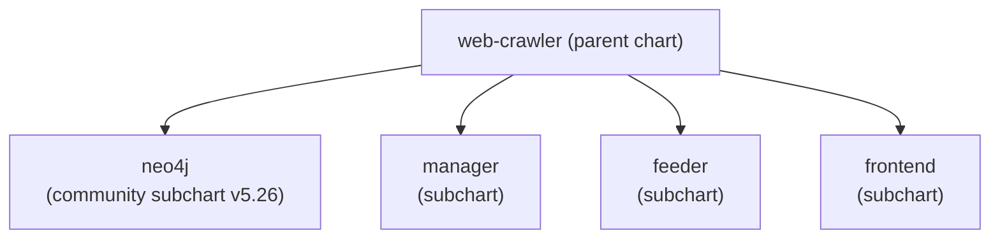
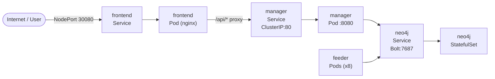

# Deployment Guide

## Prerequisites

- [kubectl](https://kubernetes.io/docs/tasks/tools/) configured for your cluster
- [Helm 3.x](https://helm.sh/docs/intro/install/)
- A Kubernetes cluster (minikube, EKS, GKE, AKS, etc.)

## Helm Chart Structure

The project uses a parent Helm chart with subcharts:



All configuration is managed through the parent chart's `values.yaml`.

## Install from OCI Registry

The Helm chart is published as an OCI artifact to GitHub Container Registry. No `helm repo add` is needed.

```bash
helm install web-crawler oci://ghcr.io/bluedotiya/web-crawler/charts/web-crawler \
  --version 1.0.0 -n web-crawler --create-namespace
```

## Install from Local Source

```bash
# Add the Neo4j Helm repo (required for the dependency)
helm repo add neo4j https://helm.neo4j.com/neo4j

# Build dependencies
helm dependency build web-crawler

# Install
helm install web-crawler ./web-crawler -n web-crawler --create-namespace
```

## Wait for Readiness

```bash
# Wait for Neo4j StatefulSet
kubectl rollout status statefulset/crawler-neo4j -n web-crawler

# Check all pods
kubectl get pods -n web-crawler
```

## Access Services

| Service | Type | Port | URL |
|---------|------|------|-----|
| Frontend | NodePort | 30080 | `http://<NODE_IP>:30080` |
| Neo4j Browser | NodePort | 30074 | `http://<NODE_IP>:30074` |
| Neo4j Bolt | NodePort | 30087 | `bolt://<NODE_IP>:30087` |
| Manager API | ClusterIP | 80 | Internal only (proxied by Frontend) |

For minikube:

```bash
# Get the node IP
minikube ip

# Or use port-forward for the frontend
kubectl port-forward -n web-crawler svc/frontend 8080:80
```

## Start a Crawl

```bash
curl -X POST http://<FRONTEND_URL>/api/v1/crawls \
  -H 'Content-Type: application/json' \
  -d '{"url": "https://example.com", "depth": 2}'
```

Or use the web UI at `http://<FRONTEND_URL>/new`.

## Configuration Reference

Customize via `--set` flags or a values override file:

```bash
helm install web-crawler oci://ghcr.io/bluedotiya/web-crawler/charts/web-crawler \
  --version 1.0.0 -n web-crawler --create-namespace \
  --set feeder.replicaCount=16 \
  --set neo4j.neo4j.password=SecurePassword123

# Or with a values file
helm install web-crawler ./web-crawler -n web-crawler --create-namespace \
  -f my-values.yaml
```

### Global

| Value | Default | Description |
|-------|---------|-------------|
| `global.namespace` | `web-crawler` | Kubernetes namespace |

### Neo4j

| Value | Default | Description |
|-------|---------|-------------|
| `neo4j.enabled` | `true` | Deploy Neo4j |
| `neo4j.neo4j.name` | `crawler-neo4j` | StatefulSet name |
| `neo4j.neo4j.password` | `password` | Neo4j password (**change in production**) |
| `neo4j.neo4j.acceptLicenseAgreement` | `yes` | Accept Neo4j license |
| `neo4j.neo4j.resources.cpu` | `0.5` | CPU request |
| `neo4j.neo4j.resources.memory` | `2Gi` | Memory request |
| `neo4j.volumes.data.dynamic.storageClassName` | `standard` | Storage class for persistent volume |
| `neo4j.volumes.data.dynamic.requests.storage` | `3Gi` | Persistent volume size |
| `neo4j.services.neo4j.type` | `NodePort` | Service type |
| `neo4j.services.neo4j.ports.http.nodePort` | `30074` | HTTP browser NodePort |
| `neo4j.services.neo4j.ports.bolt.nodePort` | `30087` | Bolt protocol NodePort |

### Feeder

| Value | Default | Description |
|-------|---------|-------------|
| `feeder.enabled` | `true` | Deploy feeders |
| `feeder.replicaCount` | `8` | Number of worker replicas |
| `feeder.image.repository` | `ghcr.io/bluedotiya/web-crawler/feeder` | Docker image |
| `feeder.image.tag` | `latest` | Image tag |
| `feeder.image.pullPolicy` | `IfNotPresent` | Pull policy |
| `feeder.resources.requests.memory` | `256Mi` | Memory request |
| `feeder.resources.requests.cpu` | `100m` | CPU request |
| `feeder.resources.limits.memory` | `512Mi` | Memory limit |
| `feeder.resources.limits.cpu` | `500m` | CPU limit |
| `feeder.env.NEO4J_DNS_NAME` | `crawler-neo4j-lb-neo4j...` | Neo4j Bolt address |
| `feeder.secretName` | `neo4j-credentials` | Secret with NEO4J_USERNAME/PASSWORD |

### Manager

| Value | Default | Description |
|-------|---------|-------------|
| `manager.enabled` | `true` | Deploy manager |
| `manager.replicaCount` | `1` | Number of replicas |
| `manager.image.repository` | `ghcr.io/bluedotiya/web-crawler/manager` | Docker image |
| `manager.image.tag` | `latest` | Image tag |
| `manager.service.type` | `ClusterIP` | Service type |
| `manager.service.port` | `80` | Service port |
| `manager.service.targetPort` | `8080` | Container port |
| `manager.resources.requests.memory` | `256Mi` | Memory request |
| `manager.resources.requests.cpu` | `100m` | CPU request |
| `manager.resources.limits.memory` | `512Mi` | Memory limit |
| `manager.resources.limits.cpu` | `500m` | CPU limit |
| `manager.env.NEO4J_DNS_NAME` | `crawler-neo4j-lb-neo4j...` | Neo4j Bolt address |
| `manager.secretName` | `neo4j-credentials` | Secret with NEO4J_USERNAME/PASSWORD |

### Frontend

| Value | Default | Description |
|-------|---------|-------------|
| `frontend.enabled` | `true` | Deploy frontend |
| `frontend.replicaCount` | `1` | Number of replicas |
| `frontend.image.repository` | `ghcr.io/bluedotiya/web-crawler/frontend` | Docker image |
| `frontend.image.tag` | `latest` | Image tag |
| `frontend.service.type` | `NodePort` | Service type |
| `frontend.service.port` | `80` | Service port |
| `frontend.service.targetPort` | `8080` | Container port (nginx) |
| `frontend.service.nodePort` | `30080` | NodePort for external access |
| `frontend.resources.requests.memory` | `64Mi` | Memory request |
| `frontend.resources.requests.cpu` | `50m` | CPU request |
| `frontend.resources.limits.memory` | `128Mi` | Memory limit |
| `frontend.resources.limits.cpu` | `200m` | CPU limit |

## Docker Image Build

Each service has its own Dockerfile:

```bash
# Manager (Rust, multi-stage build)
docker build -t ghcr.io/bluedotiya/web-crawler/manager:latest -f manager/Dockerfile .

# Feeder (Rust, multi-stage build)
docker build -t ghcr.io/bluedotiya/web-crawler/feeder:latest -f feeder/Dockerfile .

# Frontend (Node.js build + nginx)
docker build -t ghcr.io/bluedotiya/web-crawler/frontend:latest -f frontend/Dockerfile frontend
```

## Service Architecture in Kubernetes



## Scaling

Feeder replicas can be scaled to increase crawl throughput:

```bash
# Via Helm
helm upgrade web-crawler ./web-crawler -n web-crawler \
  --set feeder.replicaCount=16

# Via kubectl
kubectl scale deployment feeder -n web-crawler --replicas=16
```

## Monitoring

- **Health endpoint**: `GET /health` — always returns 200 if the manager is running
- **Readiness endpoint**: `GET /ready` — returns 200 if Neo4j is reachable, 503 otherwise
- **Feeder health**: Each feeder exposes `GET /health` on port 8081 (liveness probe)
- **Neo4j Browser**: Access at `http://<NODE_IP>:30074` to inspect the graph directly

## Minikube Local Development

```bash
# Start minikube
minikube start

# Point Docker to minikube's daemon
eval $(minikube docker-env)

# Build images directly in minikube
docker build -t ghcr.io/bluedotiya/web-crawler/manager:latest -f manager/Dockerfile .
docker build -t ghcr.io/bluedotiya/web-crawler/feeder:latest -f feeder/Dockerfile .
docker build -t ghcr.io/bluedotiya/web-crawler/frontend:latest -f frontend/Dockerfile frontend

# Install with local images
helm dependency build web-crawler
helm install web-crawler ./web-crawler -n web-crawler --create-namespace

# Port-forward the frontend
kubectl port-forward -n web-crawler svc/frontend 8080:80
```

Open `http://localhost:8080` in your browser.
