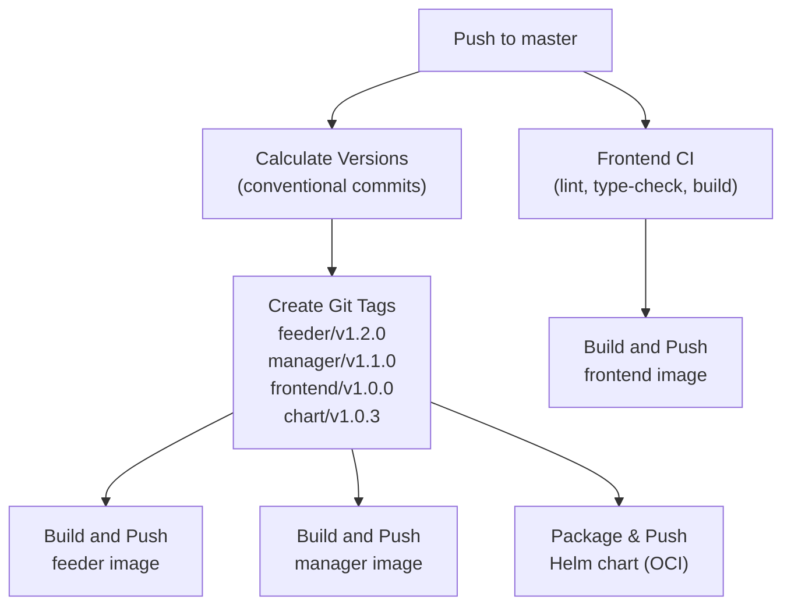

# Development Guide

## Prerequisites

| Tool | Version | Purpose |
|------|---------|---------|
| [Rust](https://rustup.rs/) | 1.83+ | Backend services (manager, feeder) |
| [Node.js](https://nodejs.org/) | 22+ | Frontend build and development |
| [Docker](https://docs.docker.com/get-docker/) | Latest | Container image builds |
| [minikube](https://minikube.sigs.k8s.io/) | Latest | Local Kubernetes cluster |
| [kubectl](https://kubernetes.io/docs/tasks/tools/) | Latest | Kubernetes CLI |
| [Helm 3.x](https://helm.sh/) | Latest | Chart management |

## Repository Structure

```
web-crawler/
├── shared/              # Shared Rust library crate
│   └── src/
│       ├── crawler.rs       # HTTP fetching and URL extraction
│       ├── dns.rs           # DNS resolution with CNAME chaining
│       ├── neo4j_client.rs  # Neo4j connection and health checks
│       ├── schema.rs        # Database index/constraint creation
│       ├── url_normalize.rs # URL normalization logic
│       └── error.rs         # Custom error types (CrawlerError)
├── manager/             # API server crate
│   ├── Dockerfile
│   └── src/
│       ├── main.rs          # Axum server setup and routing
│       ├── routes/          # HTTP route handlers
│       ├── services/        # Business logic (crawl_service, graph_service)
│       ├── models/          # Request/response types
│       ├── config.rs        # Environment-based configuration
│       └── state.rs         # Shared application state (AppState)
├── feeder/              # Background worker crate
│   ├── Dockerfile
│   └── src/
│       ├── main.rs          # Poll loop with graceful shutdown
│       ├── job.rs           # Job claiming, processing, and completion
│       ├── config.rs        # Environment-based configuration
│       └── health.rs        # Liveness probe HTTP server (:8081)
├── frontend/            # React SPA
│   ├── Dockerfile
│   ├── nginx.conf           # nginx config (SPA fallback + API proxy)
│   ├── vite.config.ts       # Vite config with API proxy for dev
│   └── src/
│       ├── App.tsx           # Router and navigation
│       ├── pages/            # Dashboard, CrawlList, NewCrawl, CrawlDetail
│       └── components/       # Reusable UI components
├── web-crawler/         # Helm parent chart
│   ├── Chart.yaml
│   ├── values.yaml          # Default configuration
│   └── templates/
├── Cargo.toml           # Workspace definition
└── .github/workflows/   # CI/CD pipelines
```

## Local Development Workflow

### Backend (Rust)

```bash
# Run all workspace tests
cargo test --workspace

# Run clippy linting
cargo clippy --workspace -- -D warnings

# Check compilation without building
cargo check --workspace

# Run a specific crate's tests
cargo test -p shared
cargo test -p manager
cargo test -p feeder
```

### Frontend (React)

```bash
cd frontend

# Install dependencies
npm install

# Start dev server (with API proxy to localhost:8080)
npm run dev

# Lint
npm run lint

# Type check
npm run type-check

# Build for production
npm run build
```

The Vite dev server proxies `/api/*` requests to the manager at `http://localhost:8080`, matching the nginx configuration in production.

### Full Integration Test

```bash
# Build images in minikube's Docker daemon, deploy with Helm, verify pods
eval $(minikube docker-env)
docker build -t ghcr.io/bluedotiya/web-crawler/manager:latest -f manager/Dockerfile .
docker build -t ghcr.io/bluedotiya/web-crawler/feeder:latest -f feeder/Dockerfile .
docker build -t ghcr.io/bluedotiya/web-crawler/frontend:latest -f frontend/Dockerfile .
helm upgrade --install web-crawler ./web-crawler -n web-crawler --create-namespace
kubectl rollout status deployment manager feeder frontend -n web-crawler
```

## Pre-commit Hooks

Configured in `.pre-commit-config.yaml`:

| Hook | Command | Scope |
|------|---------|-------|
| `cargo-check` | `cargo check --workspace` | All Rust code |
| `cargo-clippy` | `cargo clippy --workspace -- -D warnings` | All Rust code |
| `cargo-test` | `cargo test --workspace` | All Rust code |
| `frontend-lint` | `npm run lint && npm run type-check` | `frontend/` changes only |

Install the hooks:

```bash
pip install pre-commit
pre-commit install
```

## CI/CD Pipeline



Every merge to `master` automatically:

1. **Calculates versions** — compares conventional commits since the last git tag for each service path
2. **Creates git tags** — `feeder/v1.2.0`, `manager/v1.1.0`, `frontend/v1.0.0`, `chart/v1.0.3`
3. **Builds Docker images** — pushes to GHCR with both semver and `latest` tags
4. **Publishes Helm chart** — packages and pushes as an OCI artifact to GHCR

Services are versioned independently. Only services with relevant file changes get a new release. Changes to `shared/` trigger releases for both `feeder` and `manager`.

## Conventional Commits

PR titles **must** follow [conventional commit](https://www.conventionalcommits.org/) format (enforced by CI). Since PRs are squash-merged, the PR title becomes the commit message on `master` and drives the version bump.

| Prefix | Version Bump | Example |
|--------|-------------|---------|
| `feat:` | Minor (1.0.0 → 1.1.0) | `feat: add graph visualization` |
| `fix:` | Patch (1.0.0 → 1.0.1) | `fix: handle DNS timeout` |
| `feat!:` / `fix!:` | Major (1.0.0 → 2.0.0) | `feat!: redesign API` |
| `chore:`, `docs:`, `refactor:`, etc. | Patch | `chore: update dependencies` |

## Docker Image Registry

All images are published to GitHub Container Registry:

```
ghcr.io/bluedotiya/web-crawler/feeder:<version|latest>
ghcr.io/bluedotiya/web-crawler/manager:<version|latest>
ghcr.io/bluedotiya/web-crawler/frontend:<version|latest>
```

## Helm Chart OCI Publishing

The Helm chart is published as an OCI artifact — no `helm repo add` needed:

```bash
# Install directly from GHCR
helm install web-crawler oci://ghcr.io/bluedotiya/web-crawler/charts/web-crawler \
  --version 1.0.0 -n web-crawler --create-namespace

# Pull chart locally for inspection
helm pull oci://ghcr.io/bluedotiya/web-crawler/charts/web-crawler --version 1.0.0

# Show chart metadata
helm show all oci://ghcr.io/bluedotiya/web-crawler/charts/web-crawler --version 1.0.0
```
