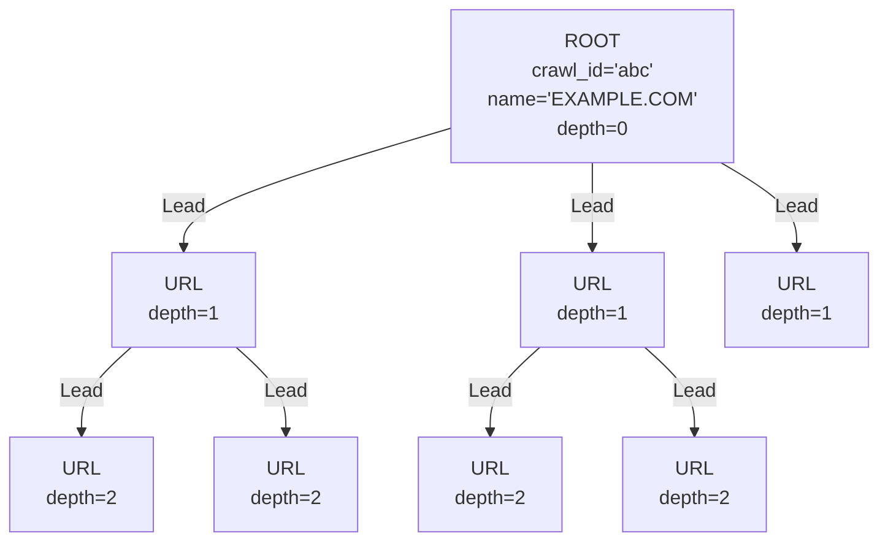
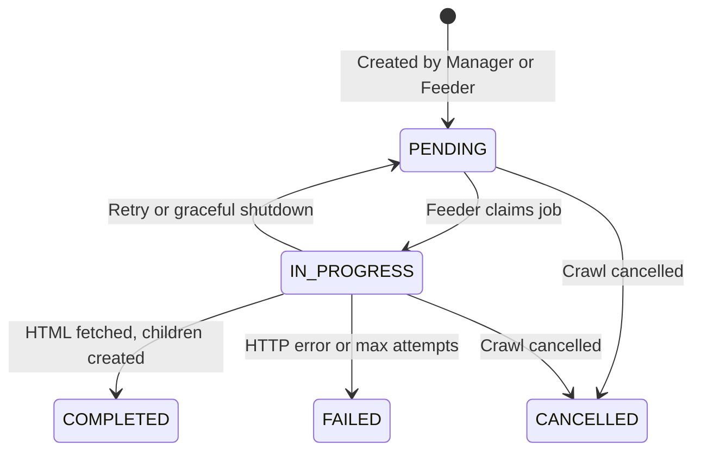

# Neo4j Graph Model

This document describes the Neo4j data model used by the Web Crawler.

## Node Labels

The graph uses two node labels: **ROOT** and **URL**.

### ROOT

Represents the entry point of a crawl. One ROOT node is created per crawl submission.

| Property | Type | Description |
|----------|------|-------------|
| `crawl_id` | String | Unique crawl identifier (UUID) |
| `name` | String | Normalized URL without protocol (e.g. `EXAMPLE.COM/PATH`) |
| `http_type` | String | Protocol prefix (`HTTPS://` or `HTTP://`) |
| `ip` | String | Resolved IP address |
| `domain` | String | Top-level domain extracted via DNS |
| `requested_depth` | Integer | Maximum crawl depth requested by the user |
| `current_depth` | Integer | Always `0` for ROOT nodes |
| `request_time` | String | HTTP request duration (e.g. `"1.234s"`) |
| `created_at` | DateTime | Timestamp when the crawl was created |

### URL

Represents a discovered page. Created during crawl initiation (depth 1) and by feeders (depth 2+).

| Property | Type | Description |
|----------|------|-------------|
| `crawl_id` | String | References the parent crawl's UUID |
| `name` | String | Normalized URL without protocol |
| `http_type` | String | Protocol prefix (`HTTPS://` or `HTTP://`) |
| `ip` | String | Resolved IP address |
| `domain` | String | Top-level domain extracted via DNS |
| `job_status` | String | Processing state (see [Status Lifecycle](#status-lifecycle)) |
| `requested_depth` | Integer | Maximum crawl depth (inherited from ROOT) |
| `current_depth` | Integer | Depth at which this URL was discovered (1, 2, 3, ...) |
| `request_time` | String | HTTP request duration of the parent page |
| `attempts` | Integer | Number of fetch attempts (incremented on failure) |
| `claimed_at` | DateTime | Timestamp when a feeder claimed this job |

## Relationship Types

### Lead

Represents a hyperlink from one page to another. Direction: **parent → child**.

```
(ROOT)-[:Lead]->(URL)     # Root page links to discovered URLs
(URL)-[:Lead]->(URL)      # Discovered page links to deeper URLs
```

No properties on the relationship.

## Graph Structure



Each crawl forms an isolated subgraph identified by `crawl_id`. Multiple crawls can coexist in the same database without interference.

## Status Lifecycle

URL nodes transition through the following statuses:



**Special cases:**
- URLs at `current_depth == requested_depth` are created directly as `COMPLETED` (no further crawling needed)
- If a fetch fails but `attempts < max_attempts`, the job resets to `PENDING` for retry
- 4xx HTTP errors cause immediate `FAILED` status regardless of attempt count
- On feeder shutdown, IN-PROGRESS jobs are reset to `PENDING`
- Stale IN-PROGRESS jobs (older than `stale_timeout_minutes`) are reclaimed by other feeders

## Indexes and Constraints

Created on startup by `schema::ensure_schema()`. All statements are idempotent.

```cypher
-- Fast job claiming: find PENDING URLs quickly
CREATE INDEX url_job_status IF NOT EXISTS FOR (n:URL) ON (n.job_status);

-- Deduplication: check if a URL already exists for a protocol
CREATE INDEX url_name_http IF NOT EXISTS FOR (n:URL) ON (n.name, n.http_type);

-- Crawl lookup: find ROOT by name and depth
CREATE INDEX root_name_depth IF NOT EXISTS FOR (n:ROOT) ON (n.name, n.requested_depth);

-- Stale job detection: find old IN-PROGRESS jobs
CREATE INDEX url_claimed_at IF NOT EXISTS FOR (n:URL) ON (n.claimed_at);

-- Uniqueness: one ROOT per crawl_id
CREATE CONSTRAINT root_crawl_id IF NOT EXISTS FOR (n:ROOT) REQUIRE n.crawl_id IS UNIQUE;

-- Crawl scoping: efficiently query all URLs belonging to a crawl
CREATE INDEX url_crawl_id IF NOT EXISTS FOR (n:URL) ON (n.crawl_id);
```

## Example Cypher Queries

### List all crawls with progress

```cypher
MATCH (r:ROOT)
OPTIONAL MATCH (u:URL {crawl_id: r.crawl_id})
WITH r,
  count(u) AS total,
  sum(CASE WHEN u.job_status = 'COMPLETED' THEN 1 ELSE 0 END) AS completed,
  sum(CASE WHEN u.job_status = 'FAILED' THEN 1 ELSE 0 END) AS failed
RETURN r.crawl_id, r.http_type + r.name AS url, total, completed, failed;
```

### Get progress for a specific crawl

```cypher
MATCH (r:ROOT {crawl_id: $crawl_id})
OPTIONAL MATCH (u:URL {crawl_id: $crawl_id})
WITH r,
  count(u) AS total,
  sum(CASE WHEN u.job_status = 'COMPLETED' THEN 1 ELSE 0 END) AS completed,
  sum(CASE WHEN u.job_status = 'PENDING' THEN 1 ELSE 0 END) AS pending,
  sum(CASE WHEN u.job_status = 'IN-PROGRESS' THEN 1 ELSE 0 END) AS in_progress,
  sum(CASE WHEN u.job_status = 'FAILED' THEN 1 ELSE 0 END) AS failed
RETURN r.name, total, completed, pending, in_progress, failed;
```

### Visualize the graph for a crawl

```cypher
MATCH (r:ROOT {crawl_id: $crawl_id})
OPTIONAL MATCH path = (r)-[:Lead*1..5]->(u:URL {crawl_id: $crawl_id})
RETURN r, path;
```

### Find pending jobs for feeders

```cypher
MATCH (n:URL)
WHERE n.current_depth <> n.requested_depth
  AND n.job_status = 'PENDING'
WITH n LIMIT 1
SET n.job_status = 'IN-PROGRESS', n.claimed_at = datetime()
RETURN n;
```

### Get statistics for a crawl

```cypher
MATCH (u:URL {crawl_id: $crawl_id})
RETURN
  count(u) AS total_urls,
  count(DISTINCT u.domain) AS unique_domains,
  max(u.current_depth) AS max_depth_reached;
```

### Cancel a crawl

```cypher
MATCH (u:URL {crawl_id: $crawl_id})
WHERE u.job_status IN ['PENDING', 'IN-PROGRESS']
SET u.job_status = 'CANCELLED';
```
